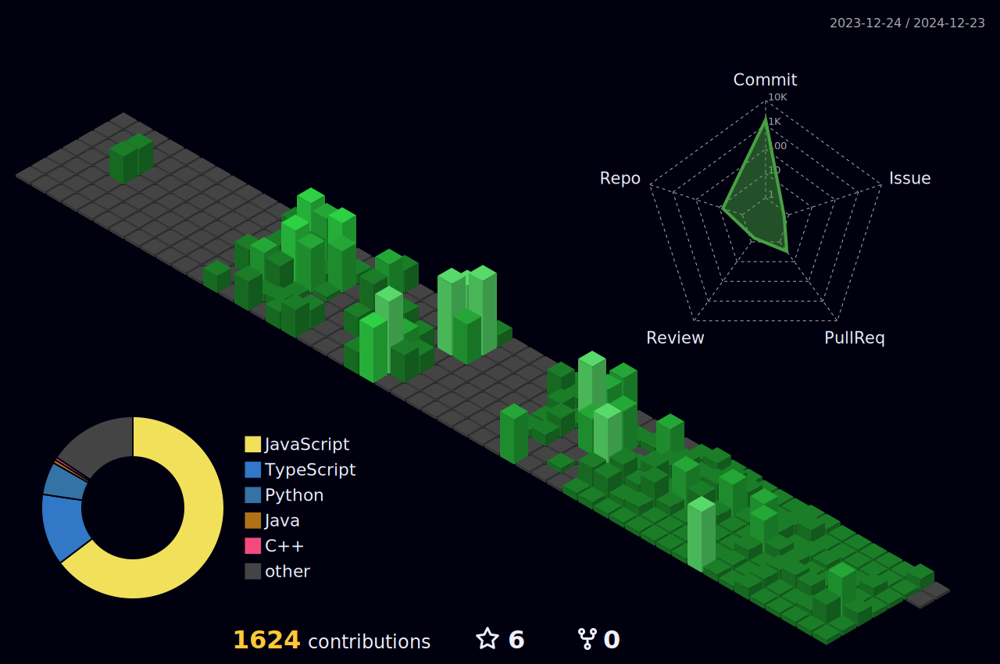

  🌱 현재 프론트엔드와 백엔드를 같이 공부하며 발전하고 있습니다! 
  📫 <strong>연락처:</strong> <a href="mailto:kimbosung222@naver.com">kimbosung222@naver.com</a>

---

## 🚀 기술 스택

<h3>🎮 게임 개발</h3>

 
  
  

<h3>🌐 웹/앱 (Frontend)</h3>

  
  
  
  
  
  

<h3>🖥️ 서버 (Backend)</h3>

  
  

  
  

 

